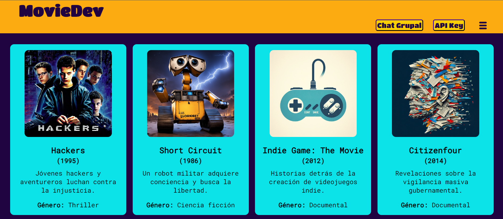
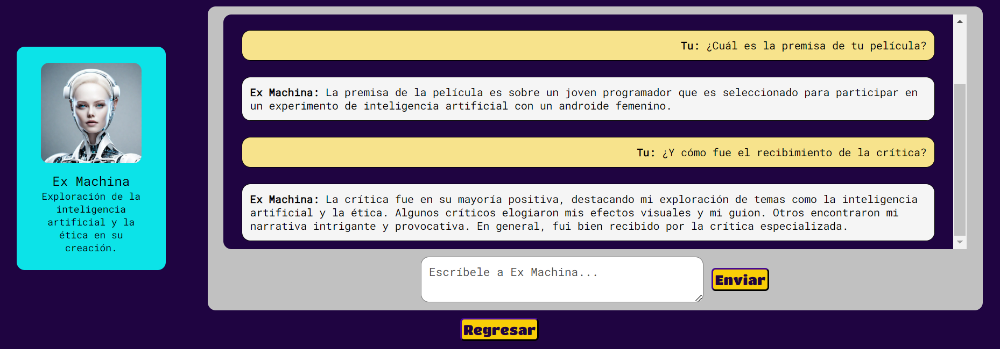
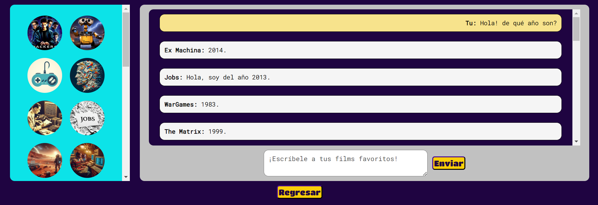

# Dataverse Chat

## Índice

* [1. Preámbulo](#1-preámbulo)
* [2. Resumen del proyecto](#2-resumen-del-proyecto)
* [3. Consideraciones generales](#3-consideraciones-generales)
* [4. Funcionalidades](#4-funcionalidades)
* [5. Consideraciones técnicas](#5-consideraciones-técnicas)
* [6. Criterios de aceptación mínimos del proyecto](#6-criterios-de-aceptación-mínimos-del-proyecto)
* [7. Objetivos de aprendizaje](#7-objetivos-de-aprendizaje)


***

## 1. Preámbulo

¿Qué tal si pudiéramos conversar con nuestras películas favoritas? La inteligencia artificial nos
puede ayudar a conectarnos con mundos ficticios. Y es por eso que nació la SPA: MovieDev

Vista inicial: 



## 2. Resumen del proyecto

En este proyecto se convirtió la aplicación desarrollada
en Dataverse en una
[Single Page Application (SPA)](https://es.wikipedia.org/wiki/Single-page_application),
manteniendo las funcionalidades de visualizar, filtrar, ordenar y
calcular alguna estadística, adicionando una nueva vista para
consultar información detallada de cada película y agregando
la posibilidad de interactuar con una película o todas ellas
a través de un sistema de chat impulsado por la
[API de OpenAI](https://openai.com/product).

### Los objetivos generales de este proyecto son los siguientes

* Desarrollar una [Single Page Application (SPA)](https://es.wikipedia.org/wiki/Single-page_application)
* Aplicar los conceptos de responsividad en el desarrollo de las vistas
* Implementar un router para la navegación entre las diferentes
vistas de la aplicación
* Integrar una API externa
* Entender la asincronía en JavaScript
* Crear una suite de pruebas unitarias que permitan testear código asíncrono

## 3. Consideraciones generales

* La lógica del proyecto está implementada completamente en JavaScript
  (ES6+), HTML y CSS. Para este proyecto **no se utilizan** 
  _frameworks_ o librerías de CSS y JS.

* Reutilizar cierta parte del código del proyecto Dataverse, sobre todo el dataset.
  Además se refactoriza el código para que sea más modular y reutilizable
  implementando nuevas funciones para lograr las funcionalidades requeridas
  en este proyecto.

* La
  interfaz será desplegada usando:
  [Vercel](https://vercel.com/).


## 4. Funcionalidades

La Single Page Application (SPA) permite,
además de **visualizar la data, filtrarla, ordenarla y calcular alguna
estadística** tal como se hizo en Dataverse, acceder a una página de detalle
de cada película y poder _interactuar_ con
las entidades del set de data.

Funcionalidades mínimas que debe tener:

* La aplicación debe ser _responsive_
* La aplicación debe ser una SPA con múltiples vistas:
  - Implementar un sistema de enrutamiento que permita la navegación
    dentro de la aplicación.
  - Cada vista de la aplicación debe ser cargada dinámicamente
    mediante JavaScript.
  - Asegurarse de que la URL se actualice de manera acorde a la vista
    cargada al igual que el `title` del documento (la pestaña del navegador).
  - La aplicación debe ser capaz de cargar la vista correspondiente a
    la URL actual al iniciar la aplicación.
* La aplicación debe mantener las funcionalidades de Dataverse: visualizar,
  filtrar, ordenar y calcular estadística de la data.
* Al hacer clic en una tarjeta de personaje/entidad, la aplicación debe
  redirigirse a una vista **con su propia URL** que muestre la información
  detallada sobre ese personaje/entidad en particular
* La aplicación debe permitir a la usuaria configurar la API Key para
  interactuar con la API de Open AI
* Usando la API de Open AI, la aplicación debe permitir al usuario
  interactuar con un personaje/entidad a través de un chat.
  



* La aplicación debe  permitir al usuario interactuar de manera simultánea
  con **todos** los personajes/entidades a través de un chat:
  - Esta funcionalidad debe cargarse en la URL `/groupChats`
  - La usuaria puede ingresar su pregunta o mensaje para todos los
    personajes/entidades en un cuadro de texto y enviarlo con un botón
  - El mensaje de la usuaria debe ser ajustado para cada personaje/entidad,
    con el objetivo que este genere una respuesta basada en su personalidad
    y conocimiento
  - Las respuestas de todos los personajes se muestran de acuerdo al orden
    respuesta.
  - Indicar visualmente cuando uno o varios personajes/entidades esten
    generando una respuesta al mensaje enviado
* La aplicación debe informar a la usuaria los errores que puedan surgir al
  interactuar con la API, como por ejemplo alcanzar la cuota de tokens por
  minuto o cualquier otro error relacionado con la API. Debería
  proporcionarse una descripción clara de la causa del problema y posibles
  soluciones.

Para que los chats anteriores puedan funcionar, es esencial que la aplicación
se integre con la IA a través de la API de OpenAI. Para ello, el equipo de
Laboratoria te proporcionará una API Key que la usuaria deberá poder ingresar
en la aplicación que tu construirás.


  
## 5. Consideraciones técnicas

El _boilerplate_ tiene la siguiente estructura de archivos:

```text
├── src
|  ├── components
                   header 
                   footer 
                   btnSalirdelChat
                   btnRegresar
                   menuSelects
                   
|  ├── data
|  |  └── dataset.js
|  ├── lib
|  |  └── dataFunctions.js
|  |   -  openAIApi.js
|  |   -  apyKeyFunction.js
|  ├── views
                   - home
                   - viewDescriptionCard
                   - viewError 
                   - viewAPIKey
                   - viewBienvenida
                   - viewIndividualChat
                   - viewGroupChat
|  ├── index.html
|  ├── index.js
|  ├── router.js
|  └── style.css
├── test
|  └── dataFunctions.spec.js
|  └── apiKey.spec.js
|  └── components.spec.js
|  └── openAIApi.spec.js
├── README.md
└── package.json

```


### Definición del producto

Nuestras usuarias son chicas que se están sumergiendo al mundo del desarrollo web y que para saber más quisieran conocer películas de tecnología relacionadas con el rubro

### Historias de usuaria

#### Hu 1
**Yo como desarrolladora web quiero** ver información más detallada y específica de cada uno de los films. **Para** saber más detalles interesantes y no quedarme con información básica.

##### Criterios de aceptación:
- Botón claramente visible en la tarjeta de cada película que permita acceder a su información detallada, intuitivamente
- Al hacer click en el botón, la página debe cambiar y mostrar información más amplia y detallada sobre la película seleccionada
- La información ampliada debe incluir detalles interesantes sobre la película, que no se mostraron en la tarjeta de inicio
- La navegación de regreso desde la vista detallada a la vista principal debe ser intuitiva y fácil de usar
- La funcionalidad de visualización de información detallada debe poder verse de manera consistente en dispositivos móviles y de escritorio.
##### Definición de terminado:
- Al darle click al botón, la información más detallada se despliega en una nueva vista con su propia URL
- El código asociado con la implementación de la vista detallada debe estar libre de errores. Debe superar sus propios tests
- La interfaz de usuario para la vista detallada debe ser estéticamente agradable y coherente con el diseño general de la página web. Respeta las buenas prácticas de UX design
- Debe ser responsive. Y realizar pruebas para garantizar que la funcionalidad de información detallada funcione correctamente en diversos navegadores y dispositivos.

#### Hu 2
**Yo como desarrolladora web quiero** entablar una conversación con cada uno de los films de MovieDev. **Para** preguntar y saber de primera mano más detalles, curiosidades y cosas interesantes que no se encuentran en su descripción.

##### Criterios de aceptación:
- En la pantalla de cada película debe haber un botón claramente visible que permita a la usuaria iniciar una conversación para interactuar con dicha película.
- Si la usuaria ingresó previamente API key en el botón correspondiente: al hacer click en el botón de chat se debe abrir un chat que permita a la usuaria enviar preguntas o comentarios.
- Si la usuaria no ingresó previamente API key en el botón correspondiente: al hacer click en el botón de chat se debe abrir la vista para ingresar credenciales API key y después de ingresadas la página automáticamente la redirigirá al chat que le permitirá a la usuaria enviar preguntas o comentarios.
- La pantalla de chat individual debe adaptarse a diferentes tipos de dispositivos y navegadores
- Se puede diferenciar claramente en el chat que hay - interacción entre la usuaria y la película
- Puede usar emoticones
- Hay botón de envío para mensajes
- Es agradable a la vista
- Tiene la opción de salir del chat por si la usuaria no quiere continuar chateando
- Hay una ventana para ver el despliegue del chat y otra para el input de la usuaria.
##### Definición de terminado:
- Botón de entrar a chat funciona sin errores, cumple con criterios de diseño UX. Es legible, con suficiente contaste. - Posición que llama a la acción de manera intuitiva.
- El despliegue de la view de chat individual se procesa de manera rápida y preciso, sin errores.
- Si es el caso, el redireccionamiento de credenciales API key hacia el chat es rápido, preciso y sin errores.
- La pantalla de chat individual es una vista independiente, con su propia URL.
- La pantalla de chat individual es responsiva.
- El funcionamiento del chat y su legibilidad fue probado con testeos de usabilidad.
- El ingreso de los inputs y la lectura del chat total se hace cómodamente sin perturbar la vista. Admite los caracteres típicos necesarios en un chat.
- El botón de envío de mensajes funciona sin errores, cumple con criterios de diseño UX. Es legible, con suficiente contaste. Posición que llama a la acción de manera intuitiva.
- La vista del chat tiene un estilo coherente que corresponde al resto de la página web.
- La función de chat supera sus propios tests.

#### Hu 3
**Yo como desarrolladora web quiero** entablar una conversación con todos los films de MovieDev y sus personajes. **Para** entretenerme y conocer más sus diferencias, similitudes y rankings.

##### Criterios de aceptación:
- Botón animado resaltado en la parte superior de la página con la función de ingresar a chatear con los personajes de los films.
- Al hacer Click en el botón debe cambiar la página y mostrar todos los personajes y la conversación con la opción de enviar emojis.
- El chat debe tener forma de nube y el nombre de quien lo escribe.
- En la parte inferior del chat el usuario debe tener la opción de regresar a la página principal.
- Todo su contenido debe ser coherente con el tamaño de pantalla desde el dispositivo del que se ingresa.
- Si la usuaria ingresa una credencial errónea se le debe avisar sin salir de la página actual.
##### Definición de terminado:
- Al clickear “chat grupal” se generará un nuevo renderizado con la vista y esta asociada al pathname: /chatgrupal y su valor generará una función específica de vista renderizadora en el que se muestre todas las partes del chat con un estilo “burbuja”.
- Los módulos deben superar los tests propuestos por Laboratoria y deben ser netamente independientes para facilitar su modulación.
- El despliegue debe ser Resposive y debe cumplir con los requisitos que se establecieron desde el inicio y ofrece una experiencia de usuaria consistente y atractiva.
- Crear un alert para advertir el ingreso erróneo.

#### Hu 4
**Yo como desarrolladora web quiero** ingresar mis credenciales para chatear con los films de MovieDev de manera segura y sencilla. **Para** no perder tiempo, no perderme en la página y hacerlo de la manera más automatizada.

##### Criterios de aceptación:
- Botón animado resaltado en la parte superior de la página con la función de ingresar la Api Key.
- Al hacer Click en el botón debe cambiar la página y mostrar un cuadro, allí el usuario ingresará su Api.
- En la parte inferior del recuadro de ingreso el usuario tiene dos opciones una para validar los datos y otra para regresar a la página principal.
- Todo su contenido debe ser coherente con el tamaño de pantalla desde el dispositivo con el que se ingresa.
##### Definición de terminado:
- Al clickear el botón de “ingresar Api Key” se generará un nuevo renderizado con la vista y esta asociada al pathname: /api y su valor generará una función específica de vista renderizadora en el que se muestre un imput con el ingreso de las credenciales de la Api Key.
- Los módulos deben superar los tests propuestos por Laboratoria y deben ser netamente independientes para facilitar su modulación.
- El despliegue debe ser Resposive y debe cumplir con los requisitos que se establecieron desde el inicio y ofrece una experiencia de usuaria consistente y atractiva.


### Diseño de la Interfaz de Usuaria

#### Prototipo de mediana fidelidad

[Prototipado en Figma]([https://www.figma.com/file/g47GRJQtlshr08n3j2mmKv/Dataverse-chat?type=design&node-id=1-651&mode=design&t=xdRUuAqpyBamvtpf-0)

Se iteró entre bocetos.

Solicitamos continuo feedback de nuestros prototipos a nuestras compañeras y/o coaches.


### Testeos de usabilidad

Hallazgos solucionados a través del diseño:
- Los usuarios no podían encontrar fácilmente las diferentes secciones o funcionalidades de la aplicación. El flujo de interacción del usuario resultaba confuso.

- No había buena respuesta del diseño en diferentes dispositivos.

- Los textos no eran muy legibles.

- Interactividad de la aplicación estaba siendo deficiente.

- El usuario no sabía qué hacerdespués del error por credencial APIKey.No había claridad.

- La paleta de colores resultaba agotadora.


## 7. Objetivos de aprendizaje


Reflexiona y luego marca los objetivos que has llegado a entender y aplicar en tu proyecto. Piensa en eso al decidir tu estrategia de trabajo.

### HTML

- [x] **Uso de HTML semántico**

  <details><summary>Links</summary><p>

  * [HTML semántico](https://curriculum.laboratoria.la/es/topics/html/html5/semantic-html)
  * [Semantics - MDN Web Docs Glossary](https://developer.mozilla.org/en-US/docs/Glossary/Semantics#Semantics_in_HTML)
</p></details>

### CSS

- [x] **Uso de selectores de CSS**

  <details><summary>Links</summary><p>

  * [Intro a CSS](https://curriculum.laboratoria.la/es/topics/css/css/intro-css)
  * [CSS Selectors - MDN](https://developer.mozilla.org/es/docs/Web/CSS/CSS_Selectors)
</p></details>

- [x] **Modelo de caja (box model): borde, margen, padding**

  <details><summary>Links</summary><p>

  * [Box Model & Display](https://curriculum.laboratoria.la/es/topics/css/css/boxmodel-and-display)
  * [The box model - MDN](https://developer.mozilla.org/en-US/docs/Learn/CSS/Building_blocks/The_box_model)
  * [Introduction to the CSS box model - MDN](https://developer.mozilla.org/en-US/docs/Web/CSS/CSS_Box_Model/Introduction_to_the_CSS_box_model)
  * [CSS display - MDN](https://developer.mozilla.org/pt-BR/docs/Web/CSS/display)
  * [display - CSS Tricks](https://css-tricks.com/almanac/properties/d/display/)
</p></details>

- [x] **Uso de flexbox en CSS**

  <details><summary>Links</summary><p>

  * [A Complete Guide to Flexbox - CSS Tricks](https://css-tricks.com/snippets/css/a-guide-to-flexbox/)
  * [Flexbox Froggy](https://flexboxfroggy.com/#es)
  * [Flexbox - MDN](https://developer.mozilla.org/en-US/docs/Learn/CSS/CSS_layout/Flexbox)
</p></details>

- [ ] **Uso de CSS Grid Layout**

  <details><summary>Links</summary><p>

  * [A Complete Guide to Grid - CSS Tricks](https://css-tricks.com/snippets/css/complete-guide-grid/)
  * [Grids - MDN](https://developer.mozilla.org/en-US/docs/Learn/CSS/CSS_layout/Grids)
</p></details>

### Web APIs

- [x] **Uso de selectores del DOM**

  <details><summary>Links</summary><p>

  * [Manipulación del DOM](https://curriculum.laboratoria.la/es/topics/browser/dom/1-dom-methods-selection)
  * [Introducción al DOM - MDN](https://developer.mozilla.org/es/docs/Web/API/Document_Object_Model/Introduction)
  * [Localizando elementos DOM usando selectores - MDN](https://developer.mozilla.org/es/docs/Web/API/Document_object_model/Locating_DOM_elements_using_selectors)
</p></details>

- [x] **Manejo de eventos del DOM (listeners, propagación, delegación)**

  <details><summary>Links</summary><p>

  * [Introducción a eventos - MDN](https://developer.mozilla.org/es/docs/Learn/JavaScript/Building_blocks/Events)
  * [EventTarget.addEventListener() - MDN](https://developer.mozilla.org/es/docs/Web/API/EventTarget/addEventListener)
  * [EventTarget.removeEventListener() - MDN](https://developer.mozilla.org/es/docs/Web/API/EventTarget/removeEventListener)
  * [El objeto Event](https://developer.mozilla.org/es/docs/Web/API/Event)
</p></details>

- [x] **Manipulación dinámica del DOM**

  <details><summary>Links</summary><p>

  * [Introducción al DOM](https://developer.mozilla.org/es/docs/Web/API/Document_Object_Model/Introduction)
  * [Node.appendChild() - MDN](https://developer.mozilla.org/es/docs/Web/API/Node/appendChild)
  * [Document.createElement() - MDN](https://developer.mozilla.org/es/docs/Web/API/Document/createElement)
  * [Document.createTextNode()](https://developer.mozilla.org/es/docs/Web/API/Document/createTextNode)
  * [Element.innerHTML - MDN](https://developer.mozilla.org/es/docs/Web/API/Element/innerHTML)
  * [Node.textContent - MDN](https://developer.mozilla.org/es/docs/Web/API/Node/textContent)
</p></details>

- [x] **Ruteado (History API, evento hashchange, window.location)**

  <details><summary>Links</summary><p>

  * [Manipulando el historial del navegador - MDN](https://developer.mozilla.org/es/docs/DOM/Manipulando_el_historial_del_navegador)
</p></details>

- [x] **Browser storage (localStorage, sessionStorage)**

  <details><summary>Links</summary><p>

  * [Window.localStorage - MDN](https://developer.mozilla.org/es/docs/Web/API/Window/localStorage)
</p></details>

- [x] **Fetch API**

  <details><summary>Links</summary><p>

  * [Fetch API - MDN](https://developer.mozilla.org/es/docs/Web/API/Fetch_API)
</p></details>

### JavaScript

- [x] **Callbacks**

  <details><summary>Links</summary><p>

  * [Función Callback - MDN](https://developer.mozilla.org/es/docs/Glossary/Callback_function)
</p></details>

- [x] **Promesas**

  <details><summary>Links</summary><p>

  * [Promise - MDN](https://developer.mozilla.org/es/docs/Web/JavaScript/Reference/Global_Objects/Promise)
  * [How to Write a JavaScript Promise - freecodecamp (en inglés)](https://www.freecodecamp.org/news/how-to-write-a-javascript-promise-4ed8d44292b8/)
</p></details>

- [x] **Uso de identificadores descriptivos (Nomenclatura y Semántica)**

- [x] **Variables (declaración, asignación, ámbito)**

  <details><summary>Links</summary><p>

  * [Valores, tipos de datos y operadores](https://curriculum.laboratoria.la/es/topics/javascript/basics/values-variables-and-types)
  * [Variables](https://curriculum.laboratoria.la/es/topics/javascript/basics/variables)
</p></details>

- [x] **Funciones (params, args, return)**

  <details><summary>Links</summary><p>

  * [Funciones (control de flujo)](https://curriculum.laboratoria.la/es/topics/javascript/flow-control/functions)
  * [Funciones clásicas](https://curriculum.laboratoria.la/es/topics/javascript/functions/classic)
  * [Arrow Functions](https://curriculum.laboratoria.la/es/topics/javascript/functions/arrow)
  * [Funciones — bloques de código reutilizables - MDN](https://developer.mozilla.org/es/docs/Learn/JavaScript/Building_blocks/Functions)
</p></details>

- [x] **Uso de condicionales (if-else, switch, operador ternario, lógica booleana)**

  <details><summary>Links</summary><p>

  * [Estructuras condicionales y repetitivas](https://curriculum.laboratoria.la/es/topics/javascript/flow-control/conditionals-and-loops)
  * [Tomando decisiones en tu código — condicionales - MDN](https://developer.mozilla.org/es/docs/Learn/JavaScript/Building_blocks/conditionals)
</p></details>

- [x] **Diferenciar entre tipos de datos primitivos y no primitivos**

- [x] **Arrays (arreglos)**

  <details><summary>Links</summary><p>

  * [Arreglos](https://curriculum.laboratoria.la/es/topics/javascript/arrays)
  * [Array - MDN](https://developer.mozilla.org/es/docs/Web/JavaScript/Reference/Global_Objects/Array/)
  * [Array.prototype.sort() - MDN](https://developer.mozilla.org/es/docs/Web/JavaScript/Reference/Global_Objects/Array/sort)
  * [Array.prototype.forEach() - MDN](https://developer.mozilla.org/es/docs/Web/JavaScript/Reference/Global_Objects/Array/forEach)
  * [Array.prototype.map() - MDN](https://developer.mozilla.org/es/docs/Web/JavaScript/Reference/Global_Objects/Array/map)
  * [Array.prototype.filter() - MDN](https://developer.mozilla.org/es/docs/Web/JavaScript/Reference/Global_Objects/Array/filter)
  * [Array.prototype.reduce() - MDN](https://developer.mozilla.org/es/docs/Web/JavaScript/Reference/Global_Objects/Array/Reduce)
</p></details>

- [x] **Objetos (key, value)**

  <details><summary>Links</summary><p>

  * [Objetos en JavaScript](https://curriculum.laboratoria.la/es/topics/javascript/objects/objects)
</p></details>

- [x] **Diferenciar entre expresiones (expressions) y sentencias (statements)**

- [x] **Uso de bucles/ciclos (while, for, for..of)**

  <details><summary>Links</summary><p>

  * [Bucles (Loops)](https://curriculum.laboratoria.la/es/topics/javascript/flow-control/loops)
  * [Bucles e iteración - MDN](https://developer.mozilla.org/es/docs/Web/JavaScript/Guide/Loops_and_iteration)
</p></details>

- [x] **Módulos de ECMAScript (ES Modules)**

  <details><summary>Links</summary><p>

  * [import - MDN](https://developer.mozilla.org/es/docs/Web/JavaScript/Reference/Statements/import)
  * [export - MDN](https://developer.mozilla.org/es/docs/Web/JavaScript/Reference/Statements/export)
</p></details>

- [x] **Pruebas unitarias (unit tests)**

  <details><summary>Links</summary><p>

  * [Empezando con Jest - Documentación oficial](https://jestjs.io/docs/es-ES/getting-started)
</p></details>

- [x] **Pruebas asíncronas**

  <details><summary>Links</summary><p>

  * [Tests de código asincrónico con Jest - Documentación oficial](https://jestjs.io/docs/es-ES/asynchronous)
</p></details>

- [x] **Uso de mocks y espías**

  <details><summary>Links</summary><p>

  * [Manual Mocks con Jest - Documentación oficial](https://jestjs.io/docs/es-ES/manual-mocks)
</p></details>

### HTTP

- [x] **Cabeceras (headers)**

  <details><summary>Links</summary><p>

  * [HTTP headers - MDN](https://developer.mozilla.org/es/docs/Web/HTTP/Headers)
</p></details>

- [x] **Consulta o petición (request) y respuesta (response).**

  <details><summary>Links</summary><p>

  * [Generalidades del protocolo HTTP - MDN](https://developer.mozilla.org/es/docs/Web/HTTP/Overview)
  * [Mensajes HTTP - MDN](https://developer.mozilla.org/es/docs/Web/HTTP/Messages)
</p></details>

- [x] **Códigos de status de HTTP**

  <details><summary>Links</summary><p>

  * [Códigos de estado de respuesta HTTP - MDN](https://developer.mozilla.org/es/docs/Web/HTTP/Status)
  * [The Complete Guide to Status Codes for Meaningful ReST APIs - dev.to](https://dev.to/khaosdoctor/the-complete-guide-to-status-codes-for-meaningful-rest-apis-1-5c5)
</p></details>

### AI Prompting

- [x] **Priming Chatbots**

  <details><summary>Links</summary><p>

  * [Priming Chatbots | Learn Prompting: Your Guide to Communicating with AI](https://learnprompting.org/es/docs/basics/priming_prompt)
</p></details>

- [x] **OpenAI API**

  <details><summary>Links</summary><p>

  * [Introduction - API Reference - OpenAI API](https://platform.openai.com/docs/introduction)
  * [Authentication - API Reference - OpenAI API](https://platform.openai.com/docs/api-reference/authentication)
  * [Making requests - API Reference - OpenAI API](https://platform.openai.com/docs/api-reference/making-requests)
  * [The chat completion object - API Reference - OpenAI API](https://platform.openai.com/docs/api-reference/chat/object)
</p></details>

### Control de Versiones (Git y GitHub)

- [x] **Git: Instalación y configuración**

- [x] **Git: Control de versiones con git (init, clone, add, commit, status, push, pull, remote)**

- [x] **Git: Integración de cambios entre ramas (branch, checkout, fetch, merge, reset, rebase, tag)**

- [x] **GitHub: Creación de cuenta y repos, configuración de llaves SSH**

- [x] **GitHub: Despliegue con GitHub Pages**

  <details><summary>Links</summary><p>

  * [Sitio oficial de GitHub Pages](https://pages.github.com/)
</p></details>

- [x] **GitHub: Colaboración en Github (branches | forks | pull requests | code review | tags)**

### Centrado en el usuario

- [x] **Diseñar y desarrollar un producto o servicio poniendo a las usuarias en el centro**

### Diseño de producto

- [x] **Crear prototipos de alta fidelidad que incluyan interacciones**

- [x] **Seguir los principios básicos de diseño visual**

### Investigación

- [x] **Planear y ejecutar testeos de usabilidad de prototipos en distintos niveles de fidelidad**

  <details><summary>Links</summary><p>

  * [Intro a testeos usabilidad](https://coda.io/@bootcamp-laboratoria/contenido-ux/test-de-usabilidad-15)
  * [Pruebas con Usuarios 1 — ¿Qué, cuándo y para qué testeamos?](https://eugeniacasabona.medium.com/pruebas-con-usuarios-1-qu%C3%A9-cu%C3%A1ndo-y-para-qu%C3%A9-testeamos-7c3a89b4b5e7)
</p></details>

